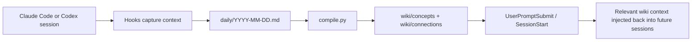
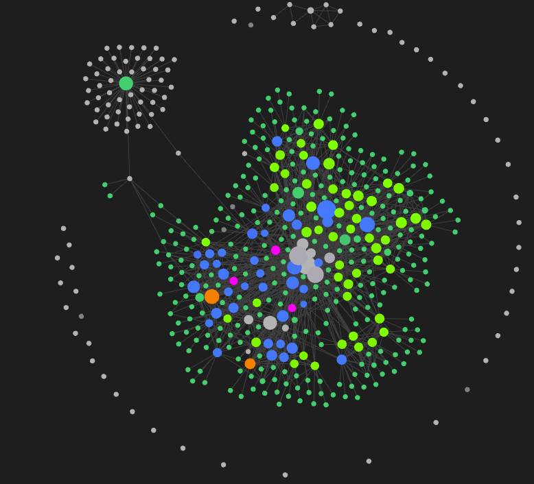

# LLM Wiki — Persistent Memory for Claude Code & Codex CLI

[](https://github.com/ub3dqy/llm-wiki/actions/workflows/wiki-lint.yml)
[](https://github.com/ub3dqy/llm-wiki/actions/workflows/personal-data-check.yml)
[](https://www.python.org/downloads/)
[](LICENSE)
[](https://claude.com/claude-code)
[](https://developers.openai.com/codex/cli)

Claude Code and Codex CLI **forget almost everything when a session ends**. This project gives them a shared, durable memory layer: a markdown wiki that captures useful session knowledge automatically, files it into `daily/`, compiles it into longer-lived articles, and injects relevant context back into future prompts.

It is built for people who want persistent agent memory **without** adding a vector database, embeddings pipeline, or another always-on service. The whole system lives in plain markdown, works with git, and opens cleanly in Obsidian.

Built on prior work: [Karpathy's LLM Wiki](https://gist.github.com/karpathy/442a6bf555914893e9891c11519de94f) pattern and [`coleam00/claude-memory-compiler`](https://github.com/coleam00/claude-memory-compiler) — see [Credits](#credits) for full attribution.

## Why this is useful

If you use Claude Code or Codex daily on non-trivial projects, you have probably hit some version of this:

- every new session starts with the agent forgetting your conventions and tradeoffs
- only the final diff survives, while the reasoning from yesterday's debugging session evaporates
- `CLAUDE.md` keeps growing, but still cannot hold all the nuance
- vector-memory setups feel like too much infrastructure for personal or small-team dev work

This project is meant to be the middle ground:

- **Automatic capture.** Session knowledge is captured on hooks and written to `daily/` without manual note-taking.
- **Targeted retrieval.** Relevant wiki pages get injected into prompts instead of dumping your whole knowledge base into context.
- **Claude + Codex support.** One wiki, two agent environments.
- **Plain markdown.** Everything is inspectable, editable, and git-committable.
- **Obsidian-friendly.** `[[wikilinks]]`, graph browsing, and zero proprietary storage.

## From clone to working in 4 commands

```bash
git clone https://github.com/ub3dqy/llm-wiki.git
cd llm-wiki
uv sync
uv run python scripts/setup.py
```

Then run:

```bash
uv run python scripts/doctor.py --quick
```

That gives you a fast health snapshot of the install and points at anything still missing or miswired.

## How the memory loop works



### Live snapshot

This is a real `wiki_cli status` snapshot from the repo during active use:

```text
Wiki Status:
  Articles: 97 (analyses: 2, concepts: 38, connections: 3, entities: 2, sources: 51, top-level: 1)
  Projects: memory-claude (55), messenger (21), office (13), personal (8), untagged (2)
  Daily logs: 5 (today: 21 entries)
  Last compile: 2026-04-14T12:06:42+00:00
  Last lint: 2026-04-14T12:40:19+00:00
  Total cost: $8.81
```

Obsidian graph view of the same wiki after real project use:



### Health checks

The repo ships with a real health gate instead of just installation instructions. Example checks from `doctor --full`:

```text
[PASS] flush_throughput: Last 7d: 74/172 flushes spawned (skip rate 57%)
[PASS] flush_quality_coverage: Last 7d: 1558410/1561277 chars reached flush.py (coverage 99.8%)
[PASS] query_preview_smoke: Query preview returned provenance-aware candidates
[PASS] wiki_cli_lint_smoke: wiki_cli structural lint reported zero blocking errors
[PASS] flush_roundtrip: session-end -> flush.py chain completed in test mode
```

That makes it much easier to trust the system after hook changes, environment drift, or agent updates.

In other words:

1. you work normally in Claude Code or Codex
2. useful context gets captured into a daily log
3. later it is compiled into wiki articles
4. future sessions get the relevant parts back instead of starting from zero

## Who this is for

- Developers who use Claude Code or Codex CLI **daily** on real projects
- People who want durable memory **across all projects**, not one `CLAUDE.md` per repo
- Anyone who tried RAG / vector memory and found it overkill for personal dev work
- Teams that want a **git-committable knowledge base** instead of notes scattered in Slack and Notion

## Compared to alternatives

The Claude Code memory space grew quickly through 2025–2026. Here is where this project sits against the most relevant alternatives:

| | **This project** | [claude-mem](https://github.com/thedotmack/claude-mem) | [coleam00/claude-memory-compiler](https://github.com/coleam00/claude-memory-compiler) | Plain `CLAUDE.md` |
|---|:---:|:---:|:---:|:---:|
| Auto-capture from sessions | ✅ | ✅ | ✅ | ❌ |
| Works with Claude Code | ✅ | ✅ | ✅ | ✅ |
| Works with Codex CLI | ✅ | ❌ | ❌ | ➖ |
| Per-prompt targeted retrieval | ✅ (keyword) | ✅ (vector) | ❌ (full dump) | ❌ (static) |
| Plain markdown storage | ✅ | ❌ | ✅ | ✅ |
| Git-committable knowledge base | ✅ | ❌ | ✅ | ✅ |
| Obsidian graph browsing | ✅ | ❌ | ✅ | ✅ |
| Zero infrastructure (no vector DB) | ✅ | ❌ | ✅ | ✅ |
| Installation | 4 commands | plugin install | manual hook setup | create file |

**Legend:** ✅ first-class · ❌ not available · ➖ partial / unofficial

**vs [`claude-mem`](https://github.com/thedotmack/claude-mem)** — claude-mem is the most-starred Claude Code memory plugin and is a great fit if you want semantic similarity search backed by Chroma and SQLite. This project takes the opposite trade-off: keyword retrieval over plain markdown, no vector database to set up, and the entire knowledge base living as `.md` files you can read, edit, and `git blame`. Pick `claude-mem` if you want vector search across a large corpus. Pick this project if you want git history, Obsidian graph browsing, Codex CLI support, and zero infrastructure.

**vs direct ancestors (`coleam00`, Karpathy)** — this fork adds Codex CLI support, content-based capture thresholds, provenance tracking, an end-to-end acceptance test in `doctor --full`, a bootstrap script, and project-aware context injection on top of `coleam00`. See [What makes this different](#what-makes-this-different) below for the full row-by-row comparison against the direct ancestor.

**vs vector-memory libraries (`mem0`, Letta, etc.)** — same trade-off as `claude-mem`: those tools are vector-first with embedding pipelines and their own storage backends. This project is markdown-first and stops being the right choice above ~2000 articles, where vector similarity starts to outperform keyword retrieval.

**vs plain `CLAUDE.md`** — static files work for stable facts ("we use TypeScript, not JavaScript"), but can't capture the *reasoning* from a debugging session or the *outcome* of yesterday's architectural discussion. This project is what you reach for when one `CLAUDE.md` per project stops scaling.

## Community and feedback

If you use this project in real work, please share that back with the repo.

- Bugs: open a bug report in GitHub Issues
- Setup trouble: open the installation/onboarding form
- Ideas: open a feature request
- Workflow examples and questions: use GitHub Discussions (or the "use case" issue form if Discussions are not active in this repo)

The repository also ships with:

- [CONTRIBUTING.md](CONTRIBUTING.md)
- [SUPPORT.md](SUPPORT.md)
- [SECURITY.md](SECURITY.md)
- [CODE_OF_CONDUCT.md](CODE_OF_CONDUCT.md)

## What makes this different

Row-by-row comparison against the direct functional ancestor, `coleam00/claude-memory-compiler` — the features that were added on top in this fork:

| Feature | coleam00 original | This project |
|---|---|---|
| Knowledge capture | SessionEnd only | SessionEnd + PreCompact + **PostToolUse async** (real-time) |
| Context injection | Full index dump at session start | **UserPromptSubmit** — per-prompt targeted article injection |
| Project awareness | None | **Project-aware SessionStart** — reads `cwd`, shows relevant articles first |
| Concurrency control | None (caused 400+ node.exe crash) | **File locks + debounce** (max 2 concurrent flush) |
| Index format | Plain list | **Enriched with `[project] (Nw)` + By Project section** |
| Scalability | Loads all articles into prompt | **Index-guided** — agent uses Read/Grep to find articles |
| Wiki save | End-of-session only | **`/wiki-save` skill** — instant save from any project |
| Decision capture | None | **Stop hook** — reminds to save architectural decisions |
| Project seeding | None | **`seed.py`** — bootstrap wiki from existing codebase |
| CLI | Verbose `uv run python scripts/...` | **`wiki_cli.py`** — unified interface |
| Recent changes | None | **Recent Wiki Changes (48h)** section in SessionStart |
| Agent SDK retry | None | **Retry on timeout** with exponential backoff |
| State management | Unbounded growth | **Pruning** (max 50 sessions in state) |
| Provenance | `sources` only | **`confidence` labels + `## Provenance`** for compile-generated articles |
| Query confidence | None | **Query preview + provenance-aware answer guidance** |

## Hook flow

The diagram above is the high-level loop. In practice, six hooks keep the memory layer alive:

### Six hooks power the system

| Hook | When | What it does |
|---|---|---|
| **SessionStart** | Session begins | Injects wiki index + project-relevant articles + recent changes |
| **SessionEnd** | Session ends | Captures transcript → flush.py → daily log |
| **PreCompact** | Before context compression | Same as SessionEnd (safety net) |
| **UserPromptSubmit** | Before each prompt | Finds and injects wiki articles matching prompt keywords |
| **PostToolUse** | After Bash commands (async) | Captures git commits, test runs as micro-entries |
| **Stop** | After each Claude response | Reminds about `/wiki-save` when architectural decisions detected |

## Installation details

If you want the full setup instead of the 4-command quick start above, use the detailed install flow below.

<details>
<summary><b>Full installation, configuration, and Codex CLI setup</b> (click to expand)</summary>

### Prerequisites

- [Claude Code](https://claude.ai/code) (CLI or IDE extension)
- [uv](https://docs.astral.sh/uv/) (Python package manager)
- Python 3.12+
- Git

### Installation

```bash
# 1. Clone the repository
git clone https://github.com/ub3dqy/llm-wiki.git
cd llm-wiki

# 2. Install Python dependencies
uv sync

# 3. Bootstrap the wiki structure
uv run python scripts/setup.py

# 4. Verify everything is wired correctly
uv run python scripts/doctor.py --quick

# 5. Follow the next steps printed by setup.py:
#    - Add hooks to ~/.claude/settings.json
#    - Copy skills/wiki-save to ~/.claude/skills/
#    - (optional) Copy codex-hooks.template.json to ~/.codex/hooks.json

# 6. Start a new Claude Code session — wiki context will be injected automatically
```

`setup.py` is idempotent — you can safely re-run it to restore missing bootstrap files
or recreate local templates.

### Configuration

After running `setup.py`, a `.env` file is created in the repo root from
`.env.example`. This file is gitignored, so you can edit it freely with your local
preferences. Supported keys:

| Key | Default | Purpose |
|-----|---------|---------|
| `WIKI_TIMEZONE` | `UTC` | IANA timezone for daily log boundaries and timestamps. Example: `America/Los_Angeles`. |
| `WIKI_COMPILE_AFTER_HOUR` | `18` | Hour (0-23) after which `flush.py` auto-triggers `compile.py`. |
| `WIKI_MAX_TURNS` | `30` | Max transcript turns captured for flush processing. |
| `WIKI_MAX_CONTEXT_CHARS` | `15000` | Max characters captured from a transcript. |
| `WIKI_MIN_FLUSH_CHARS` | `500` | Min characters of meaningful context before `flush.py` runs. Sessions below this threshold are skipped. |
| `WIKI_DEBOUNCE_SEC` | `10` | Debounce window for cascading hooks. |

Unset keys fall back to defaults. Invalid values print a `[config] warning`
at import time and also fall back to the default.

After `setup.py`, use the printed repo path when replacing `/path/to/llm-wiki` in your
hook and skill files. You can keep the rest of this section as a reference for the manual edits.

All paths in hook commands and skill files must point to your wiki clone location. Search and replace the example path with your actual path:

```
# Example: replace all occurrences
/path/to/llm-wiki  →  /your/actual/path/to/llm-wiki
```

Files to update:
- `~/.claude/settings.json` (hook commands)
- `~/.claude/skills/wiki-save/SKILL.md` (wiki paths)
- `~/.claude/CLAUDE.md` (global instructions)

### Codex CLI Setup

Codex hooks are currently run from WSL in this repo. Keep the hook commands on
Linux-style paths and use an isolated WSL `uv` environment so the repo's
Windows `.venv` is never rewritten by Linux.

1. Enable hooks in `~/.codex/config.toml`:

```toml
[features]
codex_hooks = true
```

2. Keep Codex inside WSL and open the repo from WSL (not native Windows mode).
3. Copy [`codex-hooks.template.json`](codex-hooks.template.json) to `~/.codex/hooks.json`.
4. Replace only the repo path placeholder:

```text
/path/to/llm-wiki -> /your/actual/wsl/path/to/llm-wiki
```

Do **not** replace `$HOME`. The template already resolves the current Linux user home automatically.

5. Keep the hook commands WSL-safe inside WSL:

```bash
bash -lc 'source "$HOME/.local/bin/env" 2>/dev/null; UV_BIN="${UV_BIN:-$(command -v uv)}"; if test -z "$UV_BIN"; then echo "uv not found; install uv in WSL and ensure it is on PATH" >&2; exit 1; fi; UV_PROJECT_ENVIRONMENT="$HOME/.cache/llm-wiki/.venv" UV_LINK_MODE=copy "$UV_BIN" run --directory "/path/to/llm-wiki" python hooks/codex/session-start.py'
```

The template is intentionally fail-loud now: if `uv` is missing in WSL, the hook should error
clearly instead of silently pretending everything is fine.

6. Run the doctor and smoke checks from WSL:

```bash
uv run python scripts/doctor.py --quick
uv run python scripts/doctor.py --full
uv run python scripts/wiki_cli.py doctor
uv run python scripts/wiki_cli.py doctor --quick
uv run python scripts/wiki_cli.py doctor --full
uv run python scripts/wiki_cli.py status
uv run python scripts/rebuild_index.py --check
```

`doctor.py --quick` is for fast daily checks. `doctor.py --full` runs the full gate, including WSL/Codex runtime checks and hook smokes. The same modes are available through `wiki_cli.py doctor`, and `wiki_cli.py doctor` without flags defaults to quick mode.

### Gate roles

Keep these three roles separate:

1. **Required gate (CI / pre-commit)**  
   `uv run python scripts/doctor.py --quick` and `uv run python scripts/wiki_cli.py lint`  
   This is the deterministic baseline and should be the only blocking merge gate.

2. **Manual pre-merge check (recommended, not blocker)**  
   `uv run python scripts/doctor.py --full`  
   Extends the quick gate with runtime checks, hook smokes, and an
   **end-to-end roundtrip test** that simulates SessionEnd with a dummy
   transcript and verifies the full `session-end -> flush.py` chain runs
   in test mode. Takes a few seconds. Should be run before any merge
   that touches the hook pipeline.

3. **Advisory knowledge review (non-blocker)**  
   `uv run python scripts/wiki_cli.py lint --full`  
   This includes the expensive contradiction review. Its findings are non-deterministic
   and must not be used as a merge gate.

### Repo-level instructions for Codex

This repository ships with [`AGENTS.md`](AGENTS.md) for project-level guidance, while the full wiki schema and workflow rules live in [`CLAUDE.md`](CLAUDE.md).

</details>

## Usage

### Automatic (hooks do everything)

Just use Claude Code normally. The hooks will:
1. Inject wiki context at session start
2. Inject relevant articles when you ask questions
3. Capture knowledge when sessions end
4. Auto-compile daily logs into wiki articles after 18:00
5. Mark compile-generated knowledge with explicit provenance and confidence

### Manual commands

```bash
# Show wiki status
uv run python scripts/wiki_cli.py status

# Run doctor checks
uv run python scripts/wiki_cli.py doctor
uv run python scripts/wiki_cli.py doctor --quick
uv run python scripts/wiki_cli.py doctor --full

# Compile daily logs into wiki articles
uv run python scripts/wiki_cli.py compile

# Query the knowledge base
uv run python scripts/wiki_cli.py query "how does auth work?"

# Preview likely articles without spending an Agent SDK turn
uv run python scripts/wiki_cli.py query "how does auth work?" --preview

# Run health checks
uv run python scripts/wiki_cli.py lint
uv run python scripts/wiki_cli.py lint --full

# Rebuild index with project tags and word counts
uv run python scripts/wiki_cli.py rebuild

# Seed wiki from an existing project
uv run python scripts/wiki_cli.py seed "/path/to/project"
```

### Slash command

```
/wiki-save <topic>
```

Instantly creates or updates a wiki article from the current conversation. Works from any project.

## Project Structure

<details>
<summary><b>Full directory layout</b> (click to expand)</summary>

```
.
├── .gitignore                  # Local-only files and generated workspace state
├── .python-version             # Preferred Python version for local tooling
├── AGENTS.md                   # Project-level instructions for Codex
├── CLAUDE.md                   # Wiki schema, workflows, and conventions
├── CODE_OF_CONDUCT.md          # Community participation guidelines
├── CONTRIBUTING.md             # Contribution workflow for external users
├── LICENSE
├── README.md                   # This file
├── SECURITY.md                 # Security reporting policy
├── SUPPORT.md                  # Where to ask questions and get help
├── .env.example                # Template for local .env (gitignored)
├── .github/                    # CI workflows + issue/PR templates
│   ├── ISSUE_TEMPLATE/         # bug, installation, feature, use-case + config
│   ├── PULL_REQUEST_TEMPLATE.md
│   └── workflows/              # personal-data-check.yml, wiki-lint.yml
├── codex-hooks.template.json   # Template for ~/.codex/hooks.json
├── index.example.md            # Template for the wiki index
├── pyproject.toml              # Python dependencies (uv)
│
├── hooks/                      # Hook scripts for Claude Code and Codex
│   ├── hook_utils.py           # Shared utilities + PROJECT_ALIASES loader
│   ├── post-tool-capture.py    # Async micro-capture of git/test events
│   ├── pre-compact.py          # Safety net before context compaction
│   ├── session-end.py          # Capture transcript -> flush.py
│   ├── session-start.py        # Inject wiki context at session start
│   ├── shared_context.py       # Build context with per-section budgets
│   ├── shared_wiki_search.py   # Weighted retrieval across wiki/
│   ├── stop-wiki-reminder.py   # Remind about /wiki-save
│   ├── user-prompt-wiki.py     # Per-prompt relevant article injection
│   └── codex/                  # Codex CLI hook variants
│       ├── post-tool-capture.py
│       ├── session-start.py
│       ├── stop.py
│       └── user-prompt-wiki.py
│
├── scripts/                    # Python scripts for wiki operations
│   ├── compile.py              # Compile daily/ logs -> wiki/ articles
│   ├── config.py               # .env loader + WIKI_* settings + aliases
│   ├── doctor.py               # Health-check gate (--quick / --full)
│   ├── flush.py                # Extract insights from sessions -> daily/
│   ├── lint.py                 # Structural + provenance lint
│   ├── project_aliases.example.json  # Template for local aliases
│   ├── query.py                # Query the knowledge base
│   ├── rebuild_index.py        # Rebuild index.md from wiki metadata
│   ├── runtime_utils.py        # uv / WSL detection + build_uv_python_cmd
│   ├── seed.py                 # Bootstrap wiki from existing projects
│   ├── setup.py                # Bootstrap fresh clones (idempotent)
│   ├── utils.py                # Shared utilities (frontmatter, wikilinks)
│   └── wiki_cli.py             # Unified CLI for doctor/query/lint/etc.
│
├── settings.example.json       # Template for ~/.claude/settings.json
│
└── skills/
    └── wiki-save/
        └── SKILL.example.md    # /wiki-save slash command template
```

## Locally populated (gitignored — created by setup.py and runtime workflows)

- `wiki/{concepts,connections,sources,entities,qa,analyses}/` — wiki articles
- `daily/` — auto-captured daily conversation logs
- `raw/` — manual source documents before ingest
- `reports/` — lint reports
- `index.md`, `log.md` — wiki index and operations log (gitignored working copies)
- `.env` — local configuration overrides
- `scripts/project_aliases.local.json` — local project alias overrides

</details>

## Key Design Decisions

### Why not RAG/embeddings?

At personal scale (50-500 articles), an LLM reading a structured index outperforms vector similarity search. The wiki index serves as a table of contents — Claude reads it, identifies relevant articles, and reads them directly. No embedding infrastructure needed.

For 2000+ articles, hybrid RAG would be recommended — but that's a problem for later.

### Why separate from projects?

The wiki lives in its own git repo, not inside any project. This allows:
- Cross-project knowledge accumulation
- Global hooks that capture from every project
- Version-controlled knowledge base
- Obsidian-compatible browsing (pure markdown + wikilinks)

### Why Agent SDK for flush/compile?

The `flush.py` script uses Claude Agent SDK to evaluate whether a conversation contains valuable knowledge. This is intentional — only an LLM can judge if "we discussed the weather" is worth saving vs "we decided to use BullMQ for async task processing."

Keep the background chain (`session-end.py` / `pre-compact.py` → `flush.py` → `compile.py`)
on `uv run --directory <repo>` so the Agent SDK and project dependencies always come from the
wiki runtime, not from whichever shell interpreter happened to launch the hook.

Agent SDK uses your existing Claude subscription (Max/Team/Enterprise) — no separate API costs.

### Concurrency control

Without limits, closing multiple sessions simultaneously spawns hundreds of node.exe processes (each flush.py → Agent SDK → bundled claude.exe). File locks limit concurrent flush to 2, debounce prevents rapid-fire spawns.

## Scaling

| Articles | Strategy | Status |
|---|---|---|
| 0-50 | Full index in SessionStart context | Current |
| 50-500 | Index + UserPromptSubmit targeted injection | Current |
| 500-2000 | Category-based sub-indices | Planned |
| 2000+ | Hybrid RAG (embeddings + index) | Future |

## Maintenance Checklist

<details>
<summary><b>Post-update routines for Codex CLI and Claude Code</b> (click to expand)</summary>

### After updating Codex CLI

```bash
# 1. Check generated hook schemas in official repo
# Source of truth: openai/codex → codex-rs/hooks/schema/generated/
# NOTE: `codex app-server generate-json-schema` generates app-server
# protocol schemas, NOT hook payload schemas

# 2. Compare payload fields against hook scripts
# Check: hooks/codex/session-start.py, stop.py, user-prompt-wiki.py, post-tool-capture.py

# 3. Run doctor and smoke tests from WSL
uv run python scripts/doctor.py --full

# 4. Verify feature flag is still active
codex features list
```

Generated schemas are the **source of truth** for your installed version. Wire formats may change between Codex releases — always re-verify after updates.

### After updating Claude Code

```bash
# 1. Quick gate - structural checks and env settings
uv run python scripts/doctor.py --quick
uv run python scripts/wiki_cli.py lint

# 2. Full gate - includes end-to-end flush roundtrip
uv run python scripts/doctor.py --full

# 3. Optional: test SessionStart output manually
echo '{}' | uv run python hooks/session-start.py | python -c "import sys,json; print(len(json.load(sys.stdin)['hookSpecificOutput']['additionalContext']), 'chars')"
```

`doctor.py --full` now includes a `flush_roundtrip` check that writes a dummy
6-turn transcript, invokes `session-end.py` as a subprocess with
`WIKI_FLUSH_TEST_MODE=1`, and verifies the full chain completes. This is the
fastest way to confirm that a Claude Code update has not broken the capture
pipeline.

`wiki_cli.py lint` without flags now defaults to the cheap structural route. Use
`wiki_cli.py lint --full` only when you explicitly want the contradiction review.
That route is advisory, not blocking. The full route uses the project dependency
environment so Agent SDK checks can run even if your current shell Python is
lightweight. In WSL, the contradiction step may delegate to the Windows `uv`
runtime to keep the result consistent with the main project environment.

</details>

## Credits

- [Andrej Karpathy](https://gist.github.com/karpathy/442a6bf555914893e9891c11519de94f) — LLM Wiki concept and three-layer architecture pattern
- [Cole Medin (coleam00)](https://github.com/coleam00/claude-memory-compiler) — Memory Compiler implementation with Claude Code hooks and Agent SDK
- [Claude Code](https://claude.ai/code) — The AI coding tool this system extends
- [claude-agent-sdk](https://pypi.org/project/claude-agent-sdk/) — Python SDK for programmatic Claude Code sessions

## Community

Related projects:
- [alzheimer](https://github.com/j-p-c/alzheimer) — Hierarchical memory management for Claude Code
- [obsidian-mind](https://github.com/breferrari/obsidian-mind) — Obsidian vault as persistent memory
- [claude-code-organizer](https://github.com/mcpware/claude-code-organizer) — Memory dashboard and management

## License

MIT
